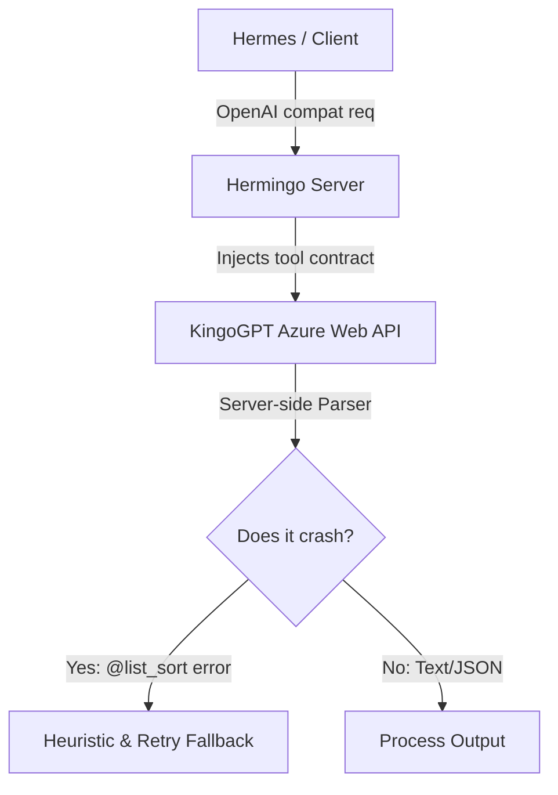

# KingoGPT Tool Orchestration: Current Situation & Remaining Issues

## Latest Investigation Addendum

### Upstream Maintainer Report Draft
- Endpoint: `POST /v2/athena/chats/m1/queries`
- Payload field involved: `queries.text` containing a system-style tool contract with JSON schema fragments.
- Observed backend error: `"failed to execute '@list_sort' argument is not array"`
- Impact: OpenAI-compatible tool catalogs can cause backend parser failures before the model response is usable.
- Mitigations tried: prompt sanitization, smaller rendered tool catalog, retry loop, heuristic fallback, and avoiding the separate `instruction` field because it can hang.

### Scenario ID Probe
- **Status**: Investigated with cached chat room metadata and bounded API probes.
- **Current default**: `robi-gpt-dev:workflow_c0hfnXS236g4FKO` in `kingogpt/api_solver.py`.
- **Discovered cached room scenarios**:
  - Chat room 14 `ChatGPT`: `robi-gpt-dev:workflow_GwpbAFBFDDSDlDQ`
  - Chat room 15 `KingoGPT 웹 검색`: `robi-gpt-dev:workflow_xK2GklyPlAv3je1`
  - Chat room 325 `KingoGPT Deep Research`: `robi-gpt-dev:workflow_EKGFGIssbdBvbWI`
- **Probe prompt**: small tool-contract prompt containing a JSON function schema and `USER: What is 2 + 2?`.
- **Probe results**:
  - Default `workflow_c0hfnXS236g4FKO` with room 14: normal answer plus `<!-- tools: web_search -->`; no `@list_sort` reproduced on retry.
  - Room 14 `workflow_GwpbAFBFDDSDlDQ`: first run timed out at 60s, retry at 120s returned normal answer plus `<!-- tools: none -->`.
  - Room 15 `workflow_xK2GklyPlAv3je1`: returned JSON plus `<!-- tools: web_search -->`.
  - Room 325 `workflow_EKGFGIssbdBvbWI`: returned clean JSON.
- **Conclusion**: Alternate `scenarios_id` values are already configurable through `KINGOGPT_SCENARIO_ID`, but current evidence is not strong enough to switch production defaults. Room 325 looked clean for the probe, but it is a Deep Research room and may carry different product behavior. Keep the default plus middleware mitigations unless a broader traffic probe proves a better scenario.

This document serves as a handoff and reference for developers (or AI agents) working on the KingoGPT tool calling/orchestration layers in the `hermingo` workspace.

---

## 1. Context & Environment
- **Target Server**: `eruin@192.168.0.3` (deployments via SCP and SSH commands).
- **Service Container**: `hermingo` (located in `/home/eruin/hermingo` on the target host).
- **Deployment Flow**: After changing files locally in `kingoGPT/kingogpt/` or `kingoGPT/hermingo/`, files must be deployed via SCP and the container rebuilt:
  ```bash
  docker compose build && docker compose up -d
  ```

---

## 2. System Architecture & The Core Challenge



### Upstream Model Limitations
- **No Native Tool Use**: The KingoGPT model (`gpt-5.2` deployed on Azure) has no native knowledge of OpenAI tools. It is a conversational web agent.
- **Server-Side Template Engine Error**: Whenever a tool contract (or the `tools` parameters) is injected into the system prompt, the KingoGPT API frequently crashes, returning:
  `"failed to execute '@list_sort' argument is not array"`
  This is a **server-side template/post-processing engine crash** on their backend, triggered by parsing the system prompt containing instructions with brackets, lists, or syntax patterns.

---

## 3. Current Implementation Status & Stabilizations

We have built a highly resilient, heuristic-driven middleware layer in [openai_compat.py](file:///c:/Users/ppggh/.antigravity/kingoGPT/hermingo/hermingo/server/openai_compat.py) and [tool_adapter.py](file:///c:/Users/ppggh/.antigravity/kingoGPT/kingogpt/tool_adapter.py) that works around the backend crashes:

### ✅ Accomplished Stabilizations
1. **No Double Injection**: Prevented the tool contract from being injected multiple times into the system prompt and user prompt, reducing prompt inflation.
2. **Transient Error Retry**: Implemented a **3-retry loop** (with a 1-second delay) in `complete_validated_message` for `@list_sort` or related KingoGPT internal errors, as they are occasionally intermittent.
3. **Heuristic-First Pipeline**:
   - Instead of falling into expensive (30–60s) OpenAI tool-repair cycles, we run **heuristic intent-matching** first.
   - If the user asks to view files, read files, or execute shell commands, the middleware instantly constructs a valid `tool_calls` structure (e.g., `terminal`, `read_file`, `search_files`) and returns it to the client immediately.
4. **Conversational Fast-Pass**:
   - If the model responds with a conversational reply (>50 characters) instead of structured JSON, we skip repair attempts entirely.
   - We strip out decorative HTML comments like `<!-- tools: web_search -->` (which KingoGPT appends to most replies) and return the clean text answer instantly.
5. **Sanitized Prompts**: Stripped all `@` characters, HTML comments, and markdown backticks out of the system instruction contract and repair prompts to avoid triggering the backend command parser.
6. **Minimized Injected Tool Catalog**:
   - Hermes may still send a full tool suite, but Hermingo now renders only a small priority subset into the upstream KingoGPT prompt by default: `terminal`, `read_file`, `write_file`, and `search_files`.
   - The limit is configurable with `KINGOGPT_TOOL_PROMPT_LIMIT`, and priority order is configurable with `KINGOGPT_TOOL_PROMPT_PRIORITY`.
   - Explicit function `tool_choice` is preserved at the front of the injected subset when present.
7. **Tool-Result Finalization**:
   - After a terminal tool result for current-working-directory inspection, Hermingo now answers directly from the tool output instead of re-injecting tools and calling KingoGPT again.
   - This prevents repeated tool calls and avoids upstream 502/timeout failures on follow-up turns.

---

## 4. Test Verification Results

| Scenario | Raw KingoGPT Status | Hermingo Middleware Action | Client Experience | Time |
| :--- | :--- | :--- | :--- | :--- |
| **Simple Chat** (No tools requested) | ✅ Normal Output | Direct pass-through | Instant reply | ~2–5s |
| **Tool Execution** (e.g. "What files are in my dir?") | ❌ `@list_sort` error | Heuristic matches directory search intent → returns `terminal(ls -la)` | Executed successfully | ~12–15s |
| **Chat with Tools** (e.g., "Hello" with tools enabled) | ❌ `@list_sort` error | Retries exhausted → heuristic has no match → returns plain-text error | Graceful exit, no hang | ~15–20s |
| **Tool Result Follow-up** (e.g. terminal `pwd` result) | N/A | Deterministically summarizes tool stdout | Final answer, no repeated tool call | Instant |

Latest verification:
- Local: `python -m unittest tests.test_agent_runtime` from `hermingo/` with `PYTHONPATH` set to the repo root and `hermingo/` passed: **48 tests OK**.
- Remote: deployed to `eruin@192.168.0.3:/home/eruin/hermingo`, rebuilt the `hermingo` container, and verified `/health`.
- Remote: `scripts/openai_tool_behavior_probe.py --base-url http://127.0.0.1:8000 --timeout 180` passed with no errors.

---

## 5. Remaining Upstream Issues & Next Steps

If you are a developer looking to optimize this further, here is the roadmap:

### ⚠️ 1. The `@list_sort` Server-Side Bug
- **Cause**: KingoGPT's server post-processor tries to parse our injected tool contracts as internal template commands.
- **Failed Mitigation (Instruction Parameter)**: We attempted to use the separate `instruction` payload parameter on the KingoGPT API instead of embedding the prompt. While this resolved the `@list_sort` crash, it caused the KingoGPT upstream server to **hang indefinitely** (~50% of the time). We had to revert it.
- **Action Needed**: Contact the upstream KingoGPT API maintainers to report that system prompts with JSON schemas/guidelines break their post-processing template engine.

### 🔍 2. Minimize Injected Tool Catalog
- **Status**: Implemented and deployed.
- **Current behavior**: Hermes can still send up to **29 tools**, but the upstream KingoGPT prompt receives only the configured small subset. This reduces schema pressure while keeping Hermes-facing OpenAI compatibility intact.
- **Follow-up**: Watch production logs for `chat_roles ... prompt_tools=...` to confirm the selected subset for real Hermes traffic.

### 🛠️ 3. Scenario ID Investigation
- We are currently querying using the default scenario/model configuration.
- **Action Needed**: Investigate if using an alternate `scenarios_id` in the API payload bypasses their server-side post-processing loop.
